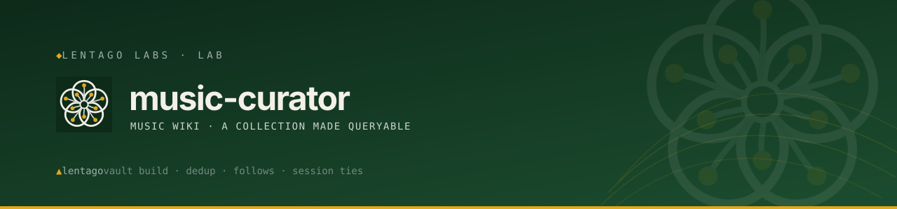

<!-- Lentago Labs brand header — generated by lentago/.github → brand/generate.py.
     Regenerate there; do not hand-edit the banner or badge URLs. -->
<a href="https://lentago.dev"></a>

[](https://github.com/lentago/music-curator/actions) [](https://github.com/lentago/music-curator/blob/main/LICENSE) [](https://deepwiki.com/lentago/music-curator)

  

# Music Curator

Music Curator turns a messy personal music collection into a queryable **taste profile for an LLM**: a Python toolchain deduplicates and merges directory-tree rips, Spotify follows, discography research, and per-album credits into a single inventory, then renders it into an Obsidian vault — a visual artist graph with collaboration edges, credit-derived session-tie edges, and streaming-rotation data. The five-phase triage that converts a raw collection dump into the cleaned, tagged inventory lives in [`music-curation-methodology.md`](music-curation-methodology.md). The rest of the repo keeps that inventory growing and queryable over time.

**Authorship:** The methodology, tooling, and documentation in this repo are co-written with [Claude](https://claude.ai) (Anthropic). I direct the work and review the output; Claude writes the code and prose. I'm an infrastructure operator, not a software engineer — please don't read this repo as a portfolio of coding ability.

## 📚 Ask this codebase (DeepWiki)

<a href="https://deepwiki.com/lentago/music-curator"></a>

[DeepWiki](https://deepwiki.com/lentago/music-curator) maintains an AI-generated wiki over this repository — architecture pages, diagrams, and a Q&A box grounded in the actual code. Every public Lentago Labs repo is indexed ([deepwiki.com/lentago](https://deepwiki.com/lentago)); it is the fastest way to orient before reading source. It is AI-generated: trust it to orient you, verify against the code before you act on it.

**Good first questions:**
- How does the `integrity.yml` workflow decide whether `vault/` is out of sync with `data/`, and what does it do when it finds drift?
- What is the difference between a Spotify follow that auto-merges via `follow-fold.yml` and one that gets held for human review?
- How does `obsidian_driver.py` build session-tie edges and person nodes from `data/credits.json`?

## 🧭 What this repo demonstrates

A personal music project running on production-grade CI/CD conventions — the ops patterns are the real exhibit.

| Pattern | How it shows up here |
|---|---|
| **Unconditional required check (no path filters)** | [`integrity.yml`](.github/workflows/integrity.yml) runs on every PR, regardless of which files changed — a required check that only triggers on matching paths gets stuck "Expected" forever on non-matching PRs, silently deadlocking merges. Documented in [lentago/.github#27](https://github.com/lentago/.github/issues/27) and traced back to [issue #9](https://github.com/lentago/music-curator/issues/9). |
| **Generated-artifact drift enforcement** | `integrity.yml` runs `obsidian_driver.py` and asserts `vault/` matches the output exactly (`git diff --quiet -- vault/`). Same failure shape as a hand-edited live dashboard reverting on next apply — CI proves the convention (regenerate, don't hand-edit) instead of trusting the honor system. Introduced in [PR #65](https://github.com/lentago/music-curator/pull/65). |
| **Tiered auto-merge with human-in-the-loop escape hatch** | [`follow-fold.yml`](.github/workflows/follow-fold.yml) auto-merges only safe reservoir seeds; a follow of a discarded artist or any unfollow posts an explanatory bot comment and holds the PR for a human. Automation isn't all-or-nothing — scope the trust. |
| **Thin-wrapper reuse of org-shared CI workflows** | [`docs-check.yml`](.github/workflows/docs-check.yml) and [`claude.yml`](.github/workflows/claude.yml) both call `lentago/shared-workflows/.github/workflows/*.yml@main`. CI logic lives once, consumed across the fleet — avoids copy-pasted YAML drift. |
| **Branch protection via repo ruleset, not classic settings** | `main` enforces two required status checks (`integrity` and `docs-check / docs-check`) and squash-only merges via a GitHub ruleset — queryable, auditable config rather than opaque UI toggles. |
| **Deliberate disable-in-place instead of deletion** | [`claude-code-review.yml`](.github/workflows/claude-code-review.yml) has its trigger changed to `workflow_dispatch` with a dated `>>> DISABLED 2026-06-25` comment. The tuned prompt and repo-specific configuration are preserved for future re-enable — no config loss, no guessing why it was turned off. |
| **Secrets and PII hygiene enforced structurally** | The Spotify GDPR streaming export — which carries per-play IP addresses — is gitignored by convention. The disabled review workflow's prompt explicitly checks for this as rule #3. Policy documented in code, not just in a wiki page. |

## 🛠️ Make a change yourself

This is a lab — the systems are real, the stakes are not. Pick a vector:

**Prove the generated wiki can't silently drift from the data**

Edit any field in `data/music-inventory.json` (try changing an artist's `category`) and open a PR without regenerating `vault/`. `integrity.yml` will run unconditionally, render the vault from scratch, compare it to the committed copy with `git diff --quiet -- vault/`, and fail the required check — blocking merge. Then run `python obsidian_driver.py`, commit the regenerated vault alongside the data change, and watch the check pass.

This is change management where the required check *is* the drift detector: every merged PR guarantees the committed vault exactly matches the data that generated it. No honor system, no post-merge reconciliation job.

**Proof this works:**
- [PR #65 — ci: replace the path-filtered validator with an unconditional integrity check](https://github.com/lentago/music-curator/pull/65) — ships `integrity.yml`, documents the drift risk (7 files change per recategorization), and proves 3 test scenarios in the PR body.
- [PR #69 — Revise artist categorization across the collection](https://github.com/lentago/music-curator/pull/69) — a real data-edit PR that would trip the drift check if `vault/` weren't regenerated alongside `data/`.

**Tiered auto-merge for automated data ingestion**

An external n8n follow watcher (running on LXC 113, not in this repo's CI) opens a PR appending raw follow events to `data/harvests/follow-events.jsonl`. `follow-fold.yml` fires on that path, runs `harvest_merge.py` and `validate.py`, regenerates `vault/`, and commits the fold onto the same PR — then auto-merges if and only if every event is a safe reservoir seed or provenance stamp. A follow of a discarded artist, or any unfollow, posts an explanatory bot comment and holds the PR open for a human.

Note: `follow-fold.yml`'s auto-merge path works because `main` currently has no required status checks that block a `GITHUB_TOKEN` push. The workflow's own header comment documents the sequencing constraint: making `integrity` a required check would break the auto-merge path unless the fold commit is pushed with a PAT that re-triggers CI. Worth reading before adding required checks to a repo with automation like this.

**Proof this works:**
- [PR #60 — Follow ingestion automation — daily drain + fold Action](https://github.com/lentago/music-curator/pull/60) — ships `follow-fold.yml` itself.
- [PR #59 — harvest\_merge.py — fold Spotify follows into the inventory](https://github.com/lentago/music-curator/pull/59) — the merge tool the Action calls.
- [PR #61 — Backfill 48 followed-but-unowned artists into the reservoir](https://github.com/lentago/music-curator/pull/61) — the reservoir-seed auto-merge path in practice.

## What this repo does

The conceptual core is a **five-phase triage** that turns a raw collection dump (a directory tree, a Spotify export, a plain list) into a cleaned, tagged inventory a model can mine:

| Phase | What happens |
|---|---|
| **1. Intake & parse** | Convert whatever the user produces into a structured artist → album hierarchy. |
| **2. Mechanical sweep** | Before any taste judgment: merge duplicate folders, drop tracker cruft, detect compilation fragmentation. |
| **3. Confident tagging** | Tag only what you genuinely know. Leave the rest in an untagged reservoir — a 15%-tagged-but-correct inventory beats a 100%-tagged-with-errors one. |
| **4. Iterative discard triage** | Rounds of 8–12 discard candidates with the user, grouped thematically. Keeps teach more than kills. |
| **5. Pivot to exploration** | Once discard rate plateaus (~15–20%), switch from triage to discovery: adjacent artists, anchor catch-up, reservoir mining, cross-referencing against what they already own. |

The toolchain keeps the inventory alive after the initial triage. Each merge layer is a stdlib-only Python tool that folds one data source into a `data/` sidecar, keyed to the roster by the `alnum()` accent-folding dedup key in [`curator_lib.py`](curator_lib.py):

- **[`validate.py`](validate.py)** — validates `data/music-inventory.json` against the JSON schema plus cross-field checks. Runs in CI on every PR via `integrity.yml`.
- **[`streaming_merge.py`](streaming_merge.py)** — folds the Spotify GDPR streaming export into `streaming-summary.json` and stamps a `rotation` class (current / dormant / historical) onto each artist.
- **[`harvest_merge.py`](harvest_merge.py)** — folds live Spotify follow events into `follows.json`, with reservoir auto-seeding for new artists.
- **[`discography_merge.py`](discography_merge.py)** — merges per-artist full-discography harvests into `discographies.json`, matched against owned albums.
- **[`obsidian_driver.py`](obsidian_driver.py)** — renders `data/` into the `vault/` Obsidian graph: artist notes, category hubs, collaboration edges, and session-tie edges from shared personnel.

## What's Here

- **[`music-curation-methodology.md`](music-curation-methodology.md)** — the conceptual core: phases, discard heuristics, pacing, anti-patterns, and exit criteria, written to be inherited by a future session with no memory of the original run.
- **[`curator_lib.py`](curator_lib.py)**, **[`validate.py`](validate.py)**, **[`schema/`](schema/)** — the engineering spine: shared dedup primitives, schema validation, and the JSON Schema itself.
- **[`data/`](data/)** — the living data source the wiki is rendered from:
  - [`music-inventory.json`](data/music-inventory.json) — the cleaned, tagged inventory (schema-validated in CI).
  - [`credits.json`](data/credits.json) — the per-album personnel layer that drives the session-tie edges.
  - [`discographies.json`](data/discographies.json) — the seeded full-discography layer: every known recording for selected anchor artists (owned or not), harvested from canonical discography pages and cross-matched against the collection by [`discography_merge.py`](discography_merge.py).
  - [`streaming-summary.json`](data/streaming-summary.json) — the listening layer: per-artist play counts, minutes and per-year history from the Spotify Extended Streaming History export, merged in by [`streaming_merge.py`](streaming_merge.py), which also stamps a `rotation` class onto each artist. The raw export stays untracked — it carries per-play IP addresses.
  - [`follows.json`](data/follows.json) — the follow layer: per-artist follow provenance (when, the triggering song, seed-ties) folded from the live Spotify follow watcher by [`harvest_merge.py`](harvest_merge.py). A follow can seed a new artist into the reservoir; see [`harvest/`](harvest/).
- **[`vault/`](vault/)** — the wiki itself: a generated Obsidian vault whose **graph view** turns the taste profile into a visual artist map. See below.
- **[`obsidian_driver.py`](obsidian_driver.py)** — the driver that renders `data/` into `vault/`.
- **[`examples/`](examples/)** — the original worked run, from a single ~25,000-file / 700-artist collection across **13 triage rounds** (16.8% discard rate):
  - [`chris-music-profile.md`](examples/chris-music-profile.md) — the distilled taste profile: foundational anchors, confirmed signal lanes, threads queued for exploration.
  - [`music-tree`](examples/music-tree) — the raw library tree that was fed in, kept as an input fixture so the before/after is visible.
- **[`harvest/`](harvest/)** — the live Spotify harvester that keeps the data source growing: a daily snapshot producer, a monthly roll-up consumer that commits `data/harvests/YYYY-MM.json` via an auto-merged PR, and a 15-minute follow watcher that records new follows together with what was playing when you made them. Three n8n workflows, each generated from a Python source-of-truth script. See [`harvest/README.md`](harvest/README.md).
- **[`roadmap/roadmap.md`](roadmap/roadmap.md)** — planned capabilities (periodic Spotify harvest, streaming + collection merge, packaging as a Claude skill), grounded in threads that surfaced during the original run.
- **[`docs/adr/`](docs/adr/)** — Architecture decisions: the key design choices behind the toolchain and automation, reconstructed from repo history.

## Obsidian graph vault

The cleaned inventory is already a graph: each tagged artist carries a **two-tier category** — one of 13 top-level genres aligned with canonical music taxonomies (AllMusic, Discogs, Wikipedia's genre families), plus an optional second-order `subcategory`. `obsidian_driver.py` renders those relationships into a self-contained [Obsidian](https://obsidian.md) vault where each artist note wikilinks into the category tree — those links are the graph edges. Open the folder in Obsidian and the graph resolves into 13 color-coded genre trees out of the box.

```bash
python obsidian_driver.py            # → vault/
```

What comes out (from the collection's 556 active artists — `meta.triage_summary.active_artists` in `data/music-inventory.json` is the authoritative count):

- **Artist notes** each link into exactly one branch of the category tree — subcategory hub where one exists, top-level hub otherwise.
- **Collaboration edges** link combo acts straight to the members they share — parsed from artist keys, drawn only to members that are themselves in the collection.
- **Session ties** wire artists together through shared personnel — ~400 edges from [`data/credits.json`](data/credits.json), crossing category clusters to show the collection's hidden wiring. `build_personnel_edges` re-resolves these against the live roster by `alnum`, so a newly-seeded artist wires in via existing credits without re-running the research.
- **Person nodes** are credited musicians who own no albums in the collection but earn a note anyway — Mike Patton wiring Faith No More to Mr. Bungle to John Zorn, Edgar Meyer showing up across half the bluegrass web.
- **Rotation** is a second axis over the same graph: each artist note carries its `current` / `dormant` / `historical` class from the streaming layer, with a by-year play histogram.

### Graph presets

The vault ships a switchable preset library in `.obsidian/graph-presets/`; the active one is installed as `graph.json`. Pick with `--graph`:

| Preset | What it shows |
|---|---|
| `default` | The full taste map — every artist clustered under its category tree, colored by top-level genre. |
| `artist-web` | Only the direct artist↔artist edges (collaborations and session ties), with the taxonomy stripped away. |
| `rotation` | The same map recolored by listening rather than genre — green still in play, amber dormant, slate blue shelf-only. |
| `source-follow` | Highlights the Spotify follow set over the taste map. Orphans are shown, so freshly seeded follows (no category yet) appear as loose nodes alongside the connected ones. |

```bash
python obsidian_driver.py --graph rotation
```

The vault ships pre-built at [`vault/`](vault/) so the graph is browsable without running anything. It is fully generated — regenerate rather than hand-editing. Discarded artists are dropped by default; `--include-discarded` keeps them (tagged `#discarded`).

## Origin

Distilled from a single long Claude conversation that started as "can Claude connect to Spotify?", discovered that recent-play history was too thin a sample to be meaningful, and pivoted into a full triage of an owned MP3 collection. That triage is still the generalizable part; the repo has since grown around it into the toolchain and automation described above. The `examples/` are one person's actual run, published as a demonstration rather than scrubbed away.

---

*Part of the [Lentago Labs](https://github.com/lentago) portfolio — a sibling to [reference-checker](https://github.com/lentago/reference-checker).*

🌱 **Lentago Labs** is a team learning lab — real systems, non-critical stakes, modern operations patterns demonstrated in the open. Start at the [org profile](https://github.com/lentago), and read this repo on [DeepWiki](https://deepwiki.com/lentago/music-curator).
